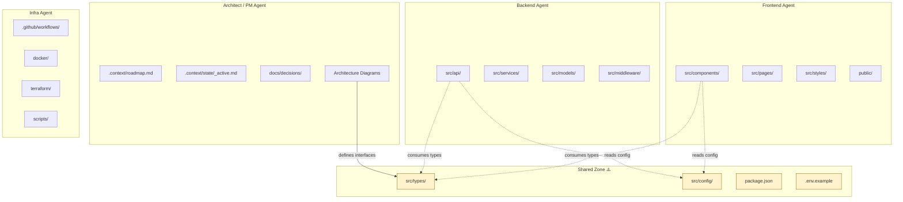

# Agent Boundary Map

> **Purpose**: Define which directories and files each agent role owns. This prevents conflicts when multiple agents work simultaneously. Update this file when the project structure changes.
>
> **Rule**: See `.context/rules/domain_multiagent.md` for coordination rules.

## How to Use This File

1. When setting up multi-agent work, fill in the zones below with your project's actual directories
2. Each agent creates a `task_*.md` file referencing their zone
3. Before modifying any file, check which zone it belongs to
4. Shared zone files require checking all active task files for conflicts

## Zone Definitions

### Exclusive Zones (One Agent Owns, Others Don't Touch)

These directories are fully owned by a single agent role. No other agent should modify files here without explicit coordination.

<!-- TEMPLATE_PLACEHOLDER: Replace examples with your project's actual structure -->

| Zone | Owner | Directories | Notes |
|------|-------|-------------|-------|
| Frontend UI | Frontend Agent | `src/components/`, `src/pages/`, `src/styles/`, `public/` | All client-side rendering, styling, and static assets |
| Backend API | Backend Agent | `src/api/`, `src/services/`, `src/middleware/` | Route handlers, business logic, middleware |
| Data Layer | Backend Agent | `src/models/`, `src/repositories/`, `prisma/` | Database models, queries, migrations |
| Infrastructure | Infra Agent | `terraform/`, `docker/`, `.github/workflows/`, `scripts/` | Deployment, CI/CD, automation |
| Documentation | PM Agent | `docs/`, `.context/sessions/` | Guides, ADRs, session summaries |

### Shared Zone (Coordinate Before Modifying)

These files affect multiple agents. Any modification requires checking active task files first and documenting changes.

| File/Directory | Why It's Shared | Coordination Method |
|----------------|----------------|---------------------|
| `src/types/` | Type definitions used across frontend and backend | Architect defines interfaces; others consume |
| `src/config/` | App configuration used everywhere | One agent at a time; document changes in task file |
| `package.json` | Dependencies affect all agents | Serialize: only one agent modifies at a time |
| `.env.example` | Environment variable documentation | Additive only; don't remove others' variables |
| `README.md` | Project documentation | PM Agent owns; others suggest via task files |
| `tsconfig.json` / `pyproject.toml` | Build configuration | Infra Agent owns; others request changes |

### No-Touch Zone (Never Modify Without Explicit Instruction)

| File/Directory | Reason |
|----------------|--------|
| `.context/rules/` | Immutable constraints — require human approval to change |
| `.context/roadmap.md` | Project direction — PM/human decision |
| `LICENSE` | Legal document |
| `.git/` | Version control internals |

## Boundary Diagram



## Customizing for Your Project

### Step 1: Map Your Directories

List every top-level directory and assign it to exactly one agent role. If a directory serves multiple agents, move it to the shared zone.

### Step 2: Identify Shared Contracts

Find all files that multiple agents depend on (types, configs, schemas, package manifests). These are your shared zone.

### Step 3: Define Interface Points

For each shared-zone item, decide who *writes* it and who *reads* it. The writer owns the file; readers consume it. Document this in the table above.

### Step 4: Create Task Files

When starting multi-agent work, each agent creates a task file referencing this boundary map:

```markdown
## Files Owned
See `.context/vision/architecture/agent-boundaries.md` — Frontend Zone

## Shared Zone Changes
- Added `UserProfile` type to `src/types/user.ts` (coordinated with Backend Agent)
```

## Common Patterns

### Pattern: API Contract First

1. Architect Agent defines API types in `src/types/api/`
2. Backend Agent implements endpoints matching those types
3. Frontend Agent builds UI consuming those types
4. No agent waits for another's implementation — they code against the shared types

### Pattern: Feature Branch Per Agent

1. Each agent works on a separate git branch
2. Shared zone changes merge to `develop` first
3. Other agents rebase onto `develop` to pick up shared changes
4. Final merge to `main` after all agents complete

### Pattern: Monorepo Workspace Isolation

For monorepo projects, assign agents to workspaces:

| Agent | Workspace | Path |
|-------|-----------|------|
| Frontend | `@app/web` | `packages/web/` |
| Backend | `@app/api` | `packages/api/` |
| Shared | `@app/shared` | `packages/shared/` |
