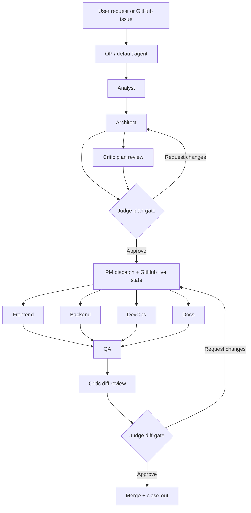

# Multi-Agent Flow

This diagram is the template repo's current working model for issue-to-merge execution.
It summarizes the flow described in `docs/guides/multi-agent-coordination.md` and the role/prompt rules under `.context/rules/**`.

## Notes

- PM is the dispatcher and coordination point between plan approval and role-owned implementation.
- Implementers may run in parallel when ownership boundaries and live-state claims permit it.
- QA, Critic, and Judge are separate delivery gates; green code alone is not approval.
