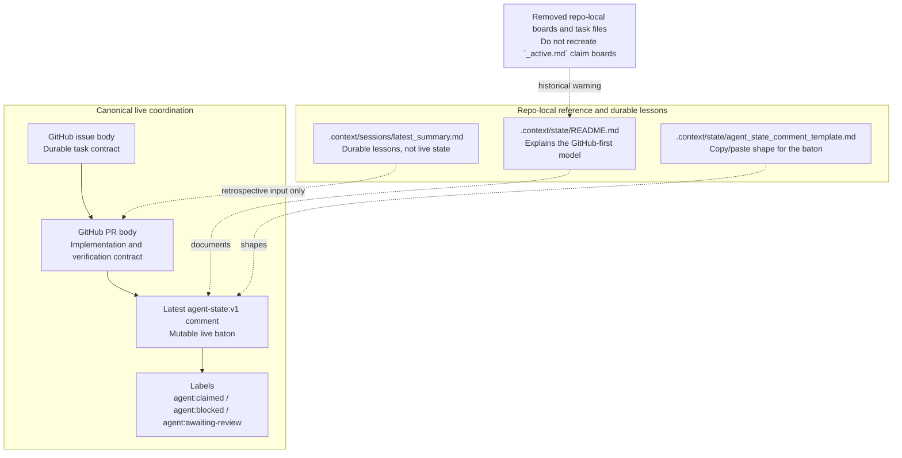

# State Surfaces

This diagram shows the ADR-025 split between canonical GitHub live-state surfaces and the repo-local reference or retrospective files that still exist in-tree.

## Notes

- Only the four GitHub surfaces in the top lane carry normal live coordination state.
- The repo-local files in the lower lane are still useful, but they are reference or retrospective surfaces rather than a second live-state system.
- Onboarding and template-detection rules need to keep this distinction explicit so downstream repos do not inherit template-specific state assumptions.
