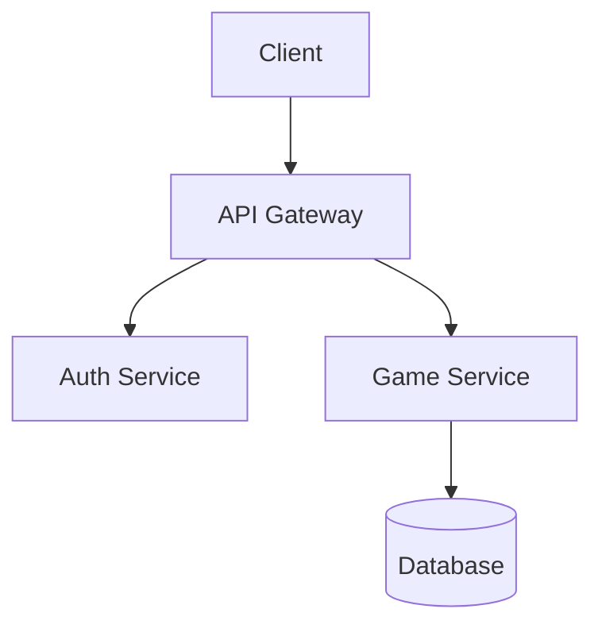

## Canonical stub source for Mode B reset

The four fenced stub blocks below are the single canonical stub source for Mode B reset.
When Step 0.2 item 6 applies, restore the files exactly from these blocks before
repopulating them with project-specific content. The `DESIGN.md` stub is
the fourth resettable surface; customize it with product-specific design direction
before UI implementation starts.

### Canonical stub: `.context/00_INDEX.md`

````md
<!-- TEMPLATE_PLACEHOLDER: Replace with actual project context index -->

# Context Pack Index

> **Purpose**: This is the entry point for AI agents to understand the project's direction, constraints, and current state.

## How to Use This Directory

The `.context/` directory contains **canonical project truth**.

### Priority Order (when conflicts arise)

See `AGENTS.md` §"Truth hierarchy" for the canonical definition. Summary:
`.context/**` > `docs/**` > codebase.

## Directory Structure

```text
.context/
|-- 00_INDEX.md          # This file - start here (The Map)
|-- backlog.yaml         # Machine-readable task list dispatched into issues
|-- backlog.schema.json  # JSON Schema for backlog.yaml
|-- roadmap.md           # Phase-by-phase plan with acceptance criteria (The Plan)
|-- rules/               # Immutable constraints and domain rules
|   |-- agent_ownership.md    # Canonical role -> owned paths map (read before editing)
|   |-- domain_code_quality.md # Built-in language-neutral SOLID/TDD/clean-code floor
|   |-- process_subagent_bootstrap.md # ADR-026 dispatch packet + subagent return contract
|   `-- domain_*.md           # Add your own stack-specific rules (e.g., domain_auth.md)
|-- sessions/            # Durable retrospectives + feedback records
|   |-- feedback_template.md # Stakeholder feedback capture template
|   `-- latest_summary.md # Durable retrospective lessons
|-- state/               # GitHub live-state guidance + comment template
|   |-- README.md        # ADR-025 state-surface guide
|   `-- agent_state_comment_template.md # GitHub live-state comment template
`-- vision/              # Design artifacts (mockups, diagrams)
  |-- README.md        # Vision/architecture index for this repo
    |-- mockups/         # UI/UX mockups and wireframes
    `-- architecture/    # System architecture diagrams (use Mermaid.js)
```

## Quick Start for Agents (Lazy Load Pattern)

1. Read `AGENTS.md` for universal rules, then this file (The Map)
2. Read your role file (for example, `.agents/<your-role>.md`) for role-specific responsibilities
3. Check the assigned GitHub issue, linked PR, latest `agent-state:v1` comment, and labels for live state
4. Read `rules/agent_ownership.md` to know which files your role may touch
5. Treat `state/` as the GitHub-first live-state reference surface; use `state/agent_state_comment_template.md` when updating the latest `agent-state:v1` baton
6. Read `sessions/latest_summary.md` for durable lessons from recent work
7. Read `roadmap.md` to understand project phases (The Plan)
8. Reference other `rules/` and `vision/` files on-demand as your work requires. `rules/domain_code_quality.md` is the built-in SOLID/TDD/clean-code floor - read it before any non-trivial refactor.

**Note:** Don't read everything at once. This index tells you what exists; load files on-demand to save tokens.

**Multi-agent workflow**: See [docs/guides/multi-agent-coordination.md](../docs/guides/multi-agent-coordination.md) for how role-specialized agents (Architect, Frontend, Backend, PM, QA, DevOps, Docs, Judge) coordinate in parallel without conflicts.

**Compliance contracts**: See `docs/compliance_schemas.md` and `docs/decisions/adr-026-compliance-contracts.md` for the ADR-026 evidence blocks (`plan_compliance`, `parent_compliance`, `subagent_compliance`) and role-contract versioning model.

**For full documentation on file purposes**, see `docs/guides/context-files-explained.md`.

## Project Summary

<!-- Replace this section with actual project summary -->

**Project Name**: [TBD]
**Description**: [TBD]
**Current Phase**: [TBD]
**Tech Stack**: [TBD]

## Key Decisions Log

| Date | Decision | Rationale | Files Affected |
|------|----------|-----------|----------------|
| YYYY-MM-DD | Example decision | Why it was made | `path/to/file` |

## Next Steps

- [ ] Replace this placeholder with actual project context
- [ ] Define roadmap phases
- [ ] Add domain rules
- [ ] Add initial design mockups if available
````

### Canonical stub: `.context/roadmap.md`

````md
<!-- TEMPLATE_PLACEHOLDER: Replace with actual project roadmap -->

# Project Roadmap

> **Purpose**: Phase-by-phase plan with clear acceptance criteria. Agents use this to understand project trajectory and prioritize work.

## Roadmap Principles

1. **Begin with the end in mind**: Start with mockups, architecture, and user experience before implementation
2. **Phases are sequential**: Complete current phase before starting next
3. **Acceptance criteria are non-negotiable**: Each phase must meet all criteria before advancing

---

## Phase 0: Vision & Architecture (Pre-Development)

**Status**: [ ] Not Started / [ ] In Progress / [ ] Complete

**Objective**: Define what we're building before writing code.

### Deliverables
- [ ] High-level architecture diagram
- [ ] UI/UX mockups (can be AI-generated)
- [ ] `DESIGN.md` customized with product-specific design direction
- [ ] Tech stack decision with rationale
- [ ] Initial domain rules documented in `rules/`

### Acceptance Criteria
- [ ] Team/stakeholders approve mockups
- [ ] Architecture supports all known requirements
- [ ] No major "unknown unknowns" remain

---

## Phase 1: Foundation

**Status**: [ ] Not Started / [ ] In Progress / [ ] Complete

**Objective**: Set up project infrastructure and CI/CD.

### Deliverables
- [ ] Repository initialized with template
- [ ] CI/CD pipeline running (lint, test, build)
- [ ] Development environment documented
- [ ] Core dependencies installed

### Acceptance Criteria
- [ ] `./test.sh` passes
- [ ] CI pipeline green on main branch
- [ ] README has working setup instructions

---

## Phase 2: Core Features

**Status**: [ ] Not Started / [ ] In Progress / [ ] Complete

**Objective**: Implement minimum viable functionality.

### Deliverables
- [ ] [Feature 1 description]
- [ ] [Feature 2 description]
- [ ] Unit test coverage > X%

### Acceptance Criteria
- [ ] All core user stories complete
- [ ] Tests pass locally and in CI
- [ ] No critical bugs open

---

## Phase 3: Polish & Launch

**Status**: [ ] Not Started / [ ] In Progress / [ ] Complete

**Objective**: Production-ready release.

### Deliverables
- [ ] Error handling complete
- [ ] Performance optimized
- [ ] Documentation complete
- [ ] Deployment pipeline working

### Acceptance Criteria
- [ ] All automated tests pass
- [ ] Manual QA complete
- [ ] Production deployment successful

---

## How to Update This Roadmap

1. Mark items complete as work progresses
2. Add new phases if scope expands
3. Update the latest `agent-state:v1` issue/PR comment to reflect live work
4. Log significant decisions in `00_INDEX.md`
````

### Canonical stub: `.context/vision/README.md`

````md
<!-- TEMPLATE_PLACEHOLDER: Add design artifacts here -->

# Vision & Design Artifacts

> **Purpose**: Store mockups, wireframes, and architecture diagrams that guide implementation. "Begin with the end in mind."

## Directory Structure

```text
vision/
|-- README.md           # This file
|-- mockups/            # UI/UX designs
|   |-- *.png/jpg       # Static mockups (AI-generated, Figma exports, etc.)
|   `-- *.md            # Mockup descriptions and context
`-- architecture/       # System design
    |-- *.md            # Architecture decision records (ADRs)
    `-- *.png/svg       # Diagrams (use Mermaid for text-based)
```

## Creating Mockups

For game development or visual apps, generate mockups before coding:

1. **AI-Generated Images**: Use tools like:
   - ChatGPT/DALL-E for concept art
   - Midjourney for stylized visuals
   - Sora/Veo for gameplay video concepts

2. **Wireframes**: Use tools like:
   - Figma, Sketch, or similar
   - Excalidraw for quick sketches
   - ASCII/text diagrams for simple layouts

3. **Save with context**: Include a markdown file explaining each mockup

## Example Mockup Description

```markdown
# Main Menu Mockup

**File**: main-menu-v1.png
**Created**: 2024-01-15
**Tool**: ChatGPT DALL-E

## Description
Dark fantasy theme with glowing runes. Center logo with three options:
- New Game (prominent)
- Continue (if save exists)
- Settings (smaller, bottom)

## Design Notes
- Color palette: Deep purple (#1a0a2e), Gold accents (#ffd700)
- Font: Medieval/runic style
- Animation: Subtle particle effects (floating embers)

## Implementation Notes
- Use CSS animations for particles (no canvas needed)
- Logo should be SVG for scaling
```

## Architecture Diagrams

Use Mermaid for version-controlled diagrams:



## Current Artifacts

<!-- Add links/descriptions as artifacts are created -->

No design artifacts yet. Add mockups to `mockups/` and diagrams to `architecture/`.
````

### Canonical stub: `DESIGN.md`

````md
<!-- TEMPLATE_PLACEHOLDER: Replace this generic design contract with the derived project's product-specific design system before UI implementation. -->

# Design contract

> **Purpose**: Root design contract for agent-assisted product design and UI implementation.
>
> **For design tools** (OpenDesign, Claude Design, Figma AI exports, etc.): load this file as the primary context before generating mockups or interactive prototypes. It defines product feel, tokens, accessibility floor, layout patterns, and where artifacts land in the repo.
>
> Replace `[TBD]` values and example principles with product-specific direction during Mode B onboarding **before frontend implementation starts**.

## Status

- **Project**: [TBD]
- **Design owner**: [TBD]
- **Current design phase**: [Discovery / Prototype / Approved / Implementing / Maintenance]
- **Last reviewed**: [YYYY-MM-DD]
- **Primary implementation stack**: [TBD]

## How agents and design tools should use this file

1. Read this file **before** invoking OpenDesign, Claude Design, or any UI generator.
2. Pass relevant sections (product identity, tokens, UX principles, accessibility floor, layout patterns) as context to the design tool — do not rely on the tool's defaults alone.
3. Treat this file as the **root design contract**; generated output must conform to tokens and accessibility rules here unless an explicit decision record says otherwise.
4. Store generated design artifacts under `.context/vision/mockups/<tool>/<YYYY-MM-DD>/` (e.g. `mockups/opendesign/`, `mockups/claude-design/`).
5. Record approved UI decisions in `docs/design/ui-decision.md` or a project-specific equivalent.
6. Do **not** treat generated prototype HTML/React as production source unless the project explicitly chooses that architecture.
7. Keep accessibility requirements visible in every design and implementation handoff.

## Product identity

Describe the product's intended feel in plain language.

- **Personality**: [e.g., calm, trustworthy, fast, playful, clinical, premium]
- **Primary audience**: [TBD]
- **Main user jobs**:
  - [Job 1]
  - [Job 2]
  - [Job 3]
- **Non-goals**:
  - [Non-goal 1]
  - [Non-goal 2]

## UX principles

Replace these with project-specific principles.

1. **Clarity before novelty**: Prefer obvious flows and readable content over decorative complexity.
2. **Fast first success**: The first useful action should be discoverable within one screen.
3. **Progressive disclosure**: Keep advanced settings available but not dominant.
4. **Accessible by default**: Keyboard, screen-reader, contrast, and touch-target requirements are not optional.
5. **Design for interruption**: Important flows should survive pauses, navigation, and resume states.

## Accessibility floor

Every UI direction and implementation should satisfy:

- semantic headings and landmarks
- visible focus states
- keyboard access to all interactive controls
- sufficient color contrast
- non-color-only status indicators
- labels for form controls and icon-only buttons
- readable mobile layouts
- touch targets appropriate for phones and tablets
- reduced-motion compatibility for animated elements
- status updates that can be understood by screen readers

## Design tokens

Use semantic token names. Do not hard-code final values here unless the project has approved a design system. Design tools should read these names and map them to concrete values in generated mockups.

### Color tokens

| Token | Purpose | Notes |
|---|---|---|
| `color-bg` | Main app background | [TBD] |
| `color-surface` | Cards, panels, dialogs | [TBD] |
| `color-surface-muted` | Secondary panels | [TBD] |
| `color-text` | Primary text | [TBD] |
| `color-text-muted` | Secondary text | [TBD] |
| `color-border` | Dividers and outlines | [TBD] |
| `color-accent` | Primary action and highlights | [TBD] |
| `color-success` | Positive state | Must not rely on color alone |
| `color-warning` | Caution state | Must not rely on color alone |
| `color-danger` | Destructive or error state | Must not rely on color alone |
| `color-focus-ring` | Keyboard focus | Must be highly visible |

### Typography tokens

| Token | Purpose | Notes |
|---|---|---|
| `font-sans` | Primary UI typeface | [TBD] |
| `font-mono` | Code or technical values | Optional |
| `text-xs` | Metadata | [TBD] |
| `text-sm` | Secondary UI text | [TBD] |
| `text-base` | Body text | [TBD] |
| `text-lg` | Section headings | [TBD] |
| `text-xl` | Page headings | [TBD] |

### Spacing tokens

| Token | Purpose |
|---|---|
| `space-1` | Tight inline gaps |
| `space-2` | Compact control gaps |
| `space-3` | Card internal spacing |
| `space-4` | Section spacing |
| `space-6` | Page spacing |
| `space-8` | Major layout separation |

## Layout patterns

Define the project's major layout patterns.

- **App shell**: [TBD]
- **Navigation model**: [TBD]
- **Dashboard layout**: [TBD]
- **Primary task layout**: [TBD]
- **Detail/review layout**: [TBD]
- **Modal/dialog usage**: [TBD]
- **Empty states**: [TBD]
- **Loading states**: [TBD]
- **Error states**: [TBD]

## Responsive behavior

Define how the UI adapts across common breakpoints.

| Viewport | Design intent | Notes |
|---|---|---|
| Phone | [TBD] | Prioritize core action and readable content |
| Tablet | [TBD] | Consider split view or secondary panels |
| Laptop/Desktop | [TBD] | Use additional width for navigation, context, and analytics |

## Component inventory

List expected reusable components. Design tools should align generated UI to these names where possible.

| Component | Purpose | Status |
|---|---|---|
| `AppShell` | Global layout/navigation | [TBD] |
| `PrimaryButton` | Main actions | [TBD] |
| `SecondaryButton` | Non-primary actions | [TBD] |
| `Card` | Surface container | [TBD] |
| `Dialog` | Confirmation or focused task | [TBD] |
| `FormField` | Accessible form control wrapper | [TBD] |
| `StatusBadge` | State indicator | [TBD] |
| `DataSummary` | Compact metric display | [TBD] |

## Design-tool workflow (OpenDesign, Claude Design, etc.)

Use this workflow when generating UI with external design tools:

1. **Load context**: Provide this `DESIGN.md` (or the relevant sections) to the design tool as system/context input.
2. **Brief**: Start from product requirements and user outcomes — not from implementation files.
3. **Generate directions**: Produce 2–3 distinct prototype directions that honor tokens, UX principles, and the accessibility floor.
4. **Save artifacts**: Export mockups, HTML, or tool-native files under `.context/vision/mockups/<tool>/<YYYY-MM-DD>/` with a short `README.md` describing each file.
5. **Critique**: Review against user outcomes, accessibility, implementation simplicity, and maintainability.
6. **Decide**: Record the selected direction in `docs/design/ui-decision.md`.
7. **Implement**: Frontend agents translate the approved direction into production components in the app's source tree — referencing mockups as **design input**, not copy-paste source, unless explicitly approved.

## Design artifact locations

| Path | Purpose |
|---|---|
| `DESIGN.md` | Root design contract (this file) |
| `.context/vision/README.md` | Vision and design-artifact index |
| `.context/vision/mockups/` | Generated or hand-authored mockups/prototypes |
| `.context/vision/mockups/opendesign/` | OpenDesign exports (convention) |
| `.context/vision/mockups/claude-design/` | Claude Design exports (convention) |
| `.context/vision/architecture/` | Architecture diagrams and user-flow diagrams |
| `docs/design/` | Human-readable design decisions, critiques, and handoffs |
| `src/**` | Production implementation, if the derived project has runtime code |

## Implementation handoff checklist

Before frontend implementation starts:

- [ ] `DESIGN.md` has been customized for the project.
- [ ] Mockups or prototypes exist under `.context/vision/mockups/`.
- [ ] A design decision has been recorded under `docs/design/`.
- [ ] Accessibility requirements are explicit.
- [ ] The component inventory is known.
- [ ] The implementation agent knows which prototype artifacts are references only.
- [ ] The production stack and test strategy are documented.

## Decision log

| Date | Decision | Rationale | Link |
|---|---|---|---|
| YYYY-MM-DD | [TBD] | [TBD] | [TBD] |

## Open questions

- [ ] What visual tone best fits this product?
- [ ] Which user flow should be prototyped first?
- [ ] What accessibility constraints are most important for the audience?
- [ ] What existing brand or design system, if any, should be used?
- [ ] Which design tools (OpenDesign, Claude Design, Figma, etc.) are approved for this project?
- [ ] Which generated artifacts are allowed to influence production implementation?
````
