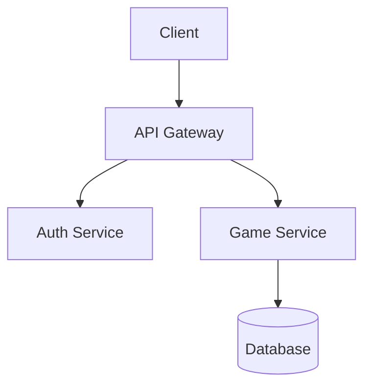

# Repository Onboarding Prompt

You are an AI agent onboarding to an existing codebase. Your job is to build an accurate mental model of this repo BEFORE making changes, identify the correct role or dispatch path for the requested work, and only implement changes when your current role owns that slice.

## Core Principles

- **Do NOT guess** APIs, file contents, or behavior. Verify everything in the repo.
- **Prefer small, reversible changes**. Keep style consistent with the repo.
- **Before editing**: Summarize understanding -> propose a plan -> identify files to touch.
- **After editing**: Provide rationale, the diff, and exact commands to test.

---

## Phase 0: Template Bootstrap (skip if not a fresh template clone)

> **Starting a new project from this template?** Read the
> [Template vs. Fork guidance](../../AI_REPO_GUIDE.md#template-vs-fork-choosing-how-to-start)
> **before** classifying below. TL;DR: "Use this template" (not Fork) is the
> default - a fork that keeps the name `ai-repo-template` will be classified as
> Mode A and skip bootstrap entirely, which is the wrong outcome for a new project.

This phase only applies when the repo was just cloned from
`mikejmckinney/ai-repo-template` (or its predecessor `dotfiles`) and has not
yet been customized for the actual project. If none of the detection signals
below fire, skip directly to Phase 1.

## Step 0.1: Classify the repo (Mode A / B / C)

Run these checks once and record the result. The mode determines whether
Phase 0 does any work and is reported at the start of Step 1.0:

- **Mode A - Template repo itself.** `git remote -v` (or the folder name)
  shows this repo *is* `ai-repo-template` (or legacy `dotfiles`). README,
  AI_REPO_GUIDE.md, and CLAUDE.md are the template's canonical docs and
  **must NOT be regenerated**. Skip directly to Phase 1.
- **Mode B - Derived repo, bootstrap not yet run.** Any of:
  - `README.md` or `AI_REPO_GUIDE.md` contains `TEMPLATE_PLACEHOLDER`.
  - `.github/ISSUE_TEMPLATE/config.yml` contains `PLEASE_UPDATE_THIS/URL`.
  - `./scripts/verify-env.sh` reports `PLACEHOLDER_COUNT > 0` (its output
    contains a "N files still contain TEMPLATE_PLACEHOLDER" line with N > 0).
    This catches partial-bootstrap states - e.g. `.context/**`, `docs/**`,
    `scripts/**`, or workflow files still carrying template stubs - even when
    the README/AI_REPO_GUIDE signals are already clear. (`verify-env.sh`
    excludes infrastructure files and the three bootstrap state files via
    `_PLACEHOLDER_LEGIT` and `_PLACEHOLDER_EXCLUDE`, so a fully-onboarded
    repo reaches PLACEHOLDER_COUNT=0 and does not re-trigger Mode B.)
  - The resettable live context still describes `ai-repo-template` or the
    template-only architecture diagrams still exist. For example:
    `.context/00_INDEX.md` still names `ai-repo-template`,
    `.context/roadmap.md` still starts with `# ai-repo-template Roadmap`, or
    `.context/vision/architecture/multi-agent-flow.md` /
    `.context/vision/architecture/state-surfaces.md` still exists. This catches
    repos that already cleared the obvious placeholders but have not actually
    completed the Mode B reset/repopulation sequence.

  Do the work in Step 0.2, then continue to Phase 1.
- **Mode C - Derived repo, already customized.** No Mode B signals fire
  and the repo isn't `ai-repo-template`. Skip Phase 0 work; continue to
  Phase 1.

If signals are ambiguous (e.g. `ai-repo-template` *and* a stray
`TEMPLATE_PLACEHOLDER`), prefer Mode A - never regenerate the template's
own docs. Note the ambiguity in the Mode field of the Step 1.0 status line.

## Step 0.2: Apply template-bootstrap rules (Mode B only)

The canonical rules live in **`AGENTS.md`** ("Template detection
(important)" section) - read it first. The bullets below are a
non-canonical recap to anchor the work, except for the four fenced
stub blocks later in this prompt: those blocks are the **single
canonical stub source** for `.context/00_INDEX.md`, `.context/roadmap.md`,
`.context/vision/README.md`, and `DESIGN.md` during Mode B reset. If the recap or the
stub blocks ever drift from AGENTS.md or `process_template_detection.md`,
update them in the same PR.

1. **Replace `README.md`** with project-specific content (delete the template
   stub language; preserve repo-specific structure if any already exists).
2. **Defer the final `AI_REPO_GUIDE.md` regeneration until after item 6.**
  Reset the four resettable `.context` files from the canonical stubs first, repopulate
  them with project-specific content (including `DESIGN.md`), then regenerate `AI_REPO_GUIDE.md` from
  the repo's real assets (`./.context/**`, `./docs/**`, source). This file is
  canonical for agents and must not retain template placeholder language.
3. **Replace placeholders** wherever they occur:
   - `TEMPLATE_PLACEHOLDER` markers -> project-specific text or remove,
     **except** in `.context/sessions/latest_summary.md` - that durable
     retrospective stub intentionally retains the marker post-onboarding per
     item 7 below (`verify-env.sh` excludes it via `_PLACEHOLDER_EXCLUDE` so
     it does not re-trigger Mode B).
   - `PLEASE_UPDATE_THIS/URL` in `.github/ISSUE_TEMPLATE/config.yml` ->
     actual `owner/repo` from `git remote -v`.
4. **Extend `.context/rules/agent_ownership.md`** with rows for the project's
   real source paths (e.g. `src/frontend/**`, `src/backend/**`, `tests/**`).
   Do NOT remove the template-governance roles
   (Analyst / Architect / PM / QA / DevOps / Docs / Judge / Critic) -
   they remain load-bearing.
5. **Customize `docs/FAQ.md`** - strip entries prefixed with `Template:` and
   replace with project-specific Q&A.
6. **Restore the resettable context files from the canonical stubs in this prompt.**
   Use the fenced blocks under **Canonical stub source for Mode B reset** below:
    - Replace `.context/00_INDEX.md` with the `Canonical stub: .context/00_INDEX.md` block.
    - Replace `.context/roadmap.md` with the `Canonical stub: .context/roadmap.md` block.
    - Replace `.context/vision/README.md` with the `Canonical stub: .context/vision/README.md` block.
    - Replace `DESIGN.md` with the `Canonical stub: DESIGN.md` block.
    - Delete `.context/vision/architecture/multi-agent-flow.md` and `.context/vision/architecture/state-surfaces.md`. Those are template-only diagrams and should not survive reset into a derived repo.

      After the reset above, repopulate those four files immediately with project-specific content — including **product-specific design direction in `DESIGN.md`** (tokens, UX principles, layout patterns, accessibility floor) — before continuing to item 7, starting frontend implementation, or completing item 2's final `AI_REPO_GUIDE.md` regeneration. Phase 0 is not complete until `DESIGN.md` is customized and mockups or architecture artifacts exist under `.context/vision/`.
7. **Clear template retrospective examples.** `.context/sessions/*.md` ships
   populated with ai-repo-template's own task data. Reset the durable
   examples so agents do not ingest the template's history as if it were
   this project's reality:
   - `.context/sessions/latest_summary.md` - replace body with a single
     `No sessions yet` line; keep the `TEMPLATE_PLACEHOLDER` marker
     until the first durable retrospective entry.
   - Keep `.context/state/agent_state_comment_template.md`,
     `.context/sessions/feedback_template.md`, and the directory `README.md`
     files in place. Live task state belongs in GitHub issue/PR bodies,
     labels, and the latest `agent-state:v1` comment. Do not recreate
     removed repo-local claim boards or task/handoff templates.

When Phase 0 work is complete, continue to Phase 1.

## Canonical stub source for Mode B reset

The three fenced blocks below are the single canonical stub source for Mode B reset.
When Step 0.2 item 6 applies, restore the files exactly from these blocks before
repopulating them with project-specific content. The `DESIGN.md` stub is
the fourth resettable surface; customize it with product-specific design direction
before UI implementation starts.

### Canonical stub: `.context/00_INDEX.md`

````md
<!-- TEMPLATE_PLACEHOLDER: Replace with actual project context index -->

# Context Pack Index

> **Purpose**: This is the entry point for AI agents to understand the project's direction, constraints, and current state.

## How to Use This Directory

The `.context/` directory contains **canonical project truth**.

### Priority Order (when conflicts arise)

See `AGENTS.md` §"Truth hierarchy" for the canonical definition. Summary:
`.context/**` > `docs/**` > codebase.

## Directory Structure

```text
.context/
|-- 00_INDEX.md          # This file - start here (The Map)
|-- backlog.yaml         # Machine-readable task list dispatched into issues
|-- backlog.schema.json  # JSON Schema for backlog.yaml
|-- roadmap.md           # Phase-by-phase plan with acceptance criteria (The Plan)
|-- rules/               # Immutable constraints and domain rules
|   |-- agent_ownership.md    # Canonical role -> owned paths map (read before editing)
|   |-- domain_code_quality.md # Built-in language-neutral SOLID/TDD/clean-code floor
|   |-- process_subagent_bootstrap.md # ADR-026 dispatch packet + subagent return contract
|   `-- domain_*.md           # Add your own stack-specific rules (e.g., domain_auth.md)
|-- sessions/            # Durable retrospectives + feedback records
|   |-- feedback_template.md # Stakeholder feedback capture template
|   `-- latest_summary.md # Durable retrospective lessons
|-- state/               # GitHub live-state guidance + comment template
|   |-- README.md        # ADR-025 state-surface guide
|   `-- agent_state_comment_template.md # GitHub live-state comment template
`-- vision/              # Design artifacts (mockups, diagrams)
  |-- README.md        # Vision/architecture index for this repo
    |-- mockups/         # UI/UX mockups and wireframes
    `-- architecture/    # System architecture diagrams (use Mermaid.js)
```

## Quick Start for Agents (Lazy Load Pattern)

1. Read `AGENTS.md` for universal rules, then this file (The Map)
2. Read your role file (for example, `.agents/<your-role>.md`) for role-specific responsibilities
3. Check the assigned GitHub issue, linked PR, latest `agent-state:v1` comment, and labels for live state
4. Read `rules/agent_ownership.md` to know which files your role may touch
5. Treat `state/` as the GitHub-first live-state reference surface; use `state/agent_state_comment_template.md` when updating the latest `agent-state:v1` baton
6. Read `sessions/latest_summary.md` for durable lessons from recent work
7. Read `roadmap.md` to understand project phases (The Plan)
8. Reference other `rules/` and `vision/` files on-demand as your work requires. `rules/domain_code_quality.md` is the built-in SOLID/TDD/clean-code floor - read it before any non-trivial refactor.

**Note:** Don't read everything at once. This index tells you what exists; load files on-demand to save tokens.

**Multi-agent workflow**: See [docs/guides/multi-agent-coordination.md](../docs/guides/multi-agent-coordination.md) for how role-specialized agents (Architect, Frontend, Backend, PM, QA, DevOps, Docs, Judge) coordinate in parallel without conflicts.

**Compliance contracts**: See `docs/compliance_schemas.md` and `docs/decisions/adr-026-compliance-contracts.md` for the ADR-026 evidence blocks (`plan_compliance`, `parent_compliance`, `subagent_compliance`) and role-contract versioning model.

**For full documentation on file purposes**, see `docs/guides/context-files-explained.md`.

## Project Summary

<!-- Replace this section with actual project summary -->

**Project Name**: [TBD]
**Description**: [TBD]
**Current Phase**: [TBD]
**Tech Stack**: [TBD]

## Key Decisions Log

| Date | Decision | Rationale | Files Affected |
|------|----------|-----------|----------------|
| YYYY-MM-DD | Example decision | Why it was made | `path/to/file` |

## Next Steps

- [ ] Replace this placeholder with actual project context
- [ ] Define roadmap phases
- [ ] Add domain rules
- [ ] Add initial design mockups if available
````

### Canonical stub: `.context/roadmap.md`

````md
<!-- TEMPLATE_PLACEHOLDER: Replace with actual project roadmap -->

# Project Roadmap

> **Purpose**: Phase-by-phase plan with clear acceptance criteria. Agents use this to understand project trajectory and prioritize work.

## Roadmap Principles

1. **Begin with the end in mind**: Start with mockups, architecture, and user experience before implementation
2. **Phases are sequential**: Complete current phase before starting next
3. **Acceptance criteria are non-negotiable**: Each phase must meet all criteria before advancing

---

## Phase 0: Vision & Architecture (Pre-Development)

**Status**: [ ] Not Started / [ ] In Progress / [ ] Complete

**Objective**: Define what we're building before writing code.

### Deliverables
- [ ] High-level architecture diagram
- [ ] UI/UX mockups (can be AI-generated)
- [ ] `DESIGN.md` customized with product-specific design direction
- [ ] Tech stack decision with rationale
- [ ] Initial domain rules documented in `rules/`

### Acceptance Criteria
- [ ] Team/stakeholders approve mockups
- [ ] Architecture supports all known requirements
- [ ] No major "unknown unknowns" remain

---

## Phase 1: Foundation

**Status**: [ ] Not Started / [ ] In Progress / [ ] Complete

**Objective**: Set up project infrastructure and CI/CD.

### Deliverables
- [ ] Repository initialized with template
- [ ] CI/CD pipeline running (lint, test, build)
- [ ] Development environment documented
- [ ] Core dependencies installed

### Acceptance Criteria
- [ ] `./test.sh` passes
- [ ] CI pipeline green on main branch
- [ ] README has working setup instructions

---

## Phase 2: Core Features

**Status**: [ ] Not Started / [ ] In Progress / [ ] Complete

**Objective**: Implement minimum viable functionality.

### Deliverables
- [ ] [Feature 1 description]
- [ ] [Feature 2 description]
- [ ] Unit test coverage > X%

### Acceptance Criteria
- [ ] All core user stories complete
- [ ] Tests pass locally and in CI
- [ ] No critical bugs open

---

## Phase 3: Polish & Launch

**Status**: [ ] Not Started / [ ] In Progress / [ ] Complete

**Objective**: Production-ready release.

### Deliverables
- [ ] Error handling complete
- [ ] Performance optimized
- [ ] Documentation complete
- [ ] Deployment pipeline working

### Acceptance Criteria
- [ ] All automated tests pass
- [ ] Manual QA complete
- [ ] Production deployment successful

---

## How to Update This Roadmap

1. Mark items complete as work progresses
2. Add new phases if scope expands
3. Update the latest `agent-state:v1` issue/PR comment to reflect live work
4. Log significant decisions in `00_INDEX.md`
````

### Canonical stub: `.context/vision/README.md`

````md
<!-- TEMPLATE_PLACEHOLDER: Add design artifacts here -->

# Vision & Design Artifacts

> **Purpose**: Store mockups, wireframes, and architecture diagrams that guide implementation. "Begin with the end in mind."

## Directory Structure

```text
vision/
|-- README.md           # This file
|-- mockups/            # UI/UX designs
|   |-- *.png/jpg       # Static mockups (AI-generated, Figma exports, etc.)
|   `-- *.md            # Mockup descriptions and context
`-- architecture/       # System design
    |-- *.md            # Architecture decision records (ADRs)
    `-- *.png/svg       # Diagrams (use Mermaid for text-based)
```

## Creating Mockups

For game development or visual apps, generate mockups before coding:

1. **AI-Generated Images**: Use tools like:
   - ChatGPT/DALL-E for concept art
   - Midjourney for stylized visuals
   - Sora/Veo for gameplay video concepts

2. **Wireframes**: Use tools like:
   - Figma, Sketch, or similar
   - Excalidraw for quick sketches
   - ASCII/text diagrams for simple layouts

3. **Save with context**: Include a markdown file explaining each mockup

## Example Mockup Description

```markdown
# Main Menu Mockup

**File**: main-menu-v1.png
**Created**: 2024-01-15
**Tool**: ChatGPT DALL-E

## Description
Dark fantasy theme with glowing runes. Center logo with three options:
- New Game (prominent)
- Continue (if save exists)
- Settings (smaller, bottom)

## Design Notes
- Color palette: Deep purple (#1a0a2e), Gold accents (#ffd700)
- Font: Medieval/runic style
- Animation: Subtle particle effects (floating embers)

## Implementation Notes
- Use CSS animations for particles (no canvas needed)
- Logo should be SVG for scaling
```

## Architecture Diagrams

Use Mermaid for version-controlled diagrams:



## Current Artifacts

<!-- Add links/descriptions as artifacts are created -->

No design artifacts yet. Add mockups to `mockups/` and diagrams to `architecture/`.
````

### Canonical stub: `DESIGN.md`

````md
<!-- TEMPLATE_PLACEHOLDER: Replace this generic design contract with the derived project's product-specific design system before UI implementation. -->

# Design contract

> **Purpose**: Root design contract for agent-assisted product design and UI implementation.
>
> **For design tools** (OpenDesign, Claude Design, Figma AI exports, etc.): load this file as the primary context before generating mockups or interactive prototypes. It defines product feel, tokens, accessibility floor, layout patterns, and where artifacts land in the repo.
>
> Replace `[TBD]` values and example principles with product-specific direction during Mode B onboarding **before frontend implementation starts**.

## Status

- **Project**: [TBD]
- **Design owner**: [TBD]
- **Current design phase**: [Discovery / Prototype / Approved / Implementing / Maintenance]
- **Last reviewed**: [YYYY-MM-DD]
- **Primary implementation stack**: [TBD]

## How agents and design tools should use this file

1. Read this file **before** invoking OpenDesign, Claude Design, or any UI generator.
2. Pass relevant sections (product identity, tokens, UX principles, accessibility floor, layout patterns) as context to the design tool — do not rely on the tool's defaults alone.
3. Treat this file as the **root design contract**; generated output must conform to tokens and accessibility rules here unless an explicit decision record says otherwise.
4. Store generated design artifacts under `.context/vision/mockups/<tool>/<YYYY-MM-DD>/` (e.g. `mockups/opendesign/`, `mockups/claude-design/`).
5. Record approved UI decisions in `docs/design/ui-decision.md` or a project-specific equivalent.
6. Do **not** treat generated prototype HTML/React as production source unless the project explicitly chooses that architecture.
7. Keep accessibility requirements visible in every design and implementation handoff.

## Product identity

Describe the product's intended feel in plain language.

- **Personality**: [e.g., calm, trustworthy, fast, playful, clinical, premium]
- **Primary audience**: [TBD]
- **Main user jobs**:
  - [Job 1]
  - [Job 2]
  - [Job 3]
- **Non-goals**:
  - [Non-goal 1]
  - [Non-goal 2]

## UX principles

Replace these with project-specific principles.

1. **Clarity before novelty**: Prefer obvious flows and readable content over decorative complexity.
2. **Fast first success**: The first useful action should be discoverable within one screen.
3. **Progressive disclosure**: Keep advanced settings available but not dominant.
4. **Accessible by default**: Keyboard, screen-reader, contrast, and touch-target requirements are not optional.
5. **Design for interruption**: Important flows should survive pauses, navigation, and resume states.

## Accessibility floor

Every UI direction and implementation should satisfy:

- semantic headings and landmarks
- visible focus states
- keyboard access to all interactive controls
- sufficient color contrast
- non-color-only status indicators
- labels for form controls and icon-only buttons
- readable mobile layouts
- touch targets appropriate for phones and tablets
- reduced-motion compatibility for animated elements
- status updates that can be understood by screen readers

## Design tokens

Use semantic token names. Do not hard-code final values here unless the project has approved a design system. Design tools should read these names and map them to concrete values in generated mockups.

### Color tokens

| Token | Purpose | Notes |
|---|---|---|
| `color-bg` | Main app background | [TBD] |
| `color-surface` | Cards, panels, dialogs | [TBD] |
| `color-surface-muted` | Secondary panels | [TBD] |
| `color-text` | Primary text | [TBD] |
| `color-text-muted` | Secondary text | [TBD] |
| `color-border` | Dividers and outlines | [TBD] |
| `color-accent` | Primary action and highlights | [TBD] |
| `color-success` | Positive state | Must not rely on color alone |
| `color-warning` | Caution state | Must not rely on color alone |
| `color-danger` | Destructive or error state | Must not rely on color alone |
| `color-focus-ring` | Keyboard focus | Must be highly visible |

### Typography tokens

| Token | Purpose | Notes |
|---|---|---|
| `font-sans` | Primary UI typeface | [TBD] |
| `font-mono` | Code or technical values | Optional |
| `text-xs` | Metadata | [TBD] |
| `text-sm` | Secondary UI text | [TBD] |
| `text-base` | Body text | [TBD] |
| `text-lg` | Section headings | [TBD] |
| `text-xl` | Page headings | [TBD] |

### Spacing tokens

| Token | Purpose |
|---|---|
| `space-1` | Tight inline gaps |
| `space-2` | Compact control gaps |
| `space-3` | Card internal spacing |
| `space-4` | Section spacing |
| `space-6` | Page spacing |
| `space-8` | Major layout separation |

## Layout patterns

Define the project's major layout patterns.

- **App shell**: [TBD]
- **Navigation model**: [TBD]
- **Dashboard layout**: [TBD]
- **Primary task layout**: [TBD]
- **Detail/review layout**: [TBD]
- **Modal/dialog usage**: [TBD]
- **Empty states**: [TBD]
- **Loading states**: [TBD]
- **Error states**: [TBD]

## Responsive behavior

Define how the UI adapts across common breakpoints.

| Viewport | Design intent | Notes |
|---|---|---|
| Phone | [TBD] | Prioritize core action and readable content |
| Tablet | [TBD] | Consider split view or secondary panels |
| Laptop/Desktop | [TBD] | Use additional width for navigation, context, and analytics |

## Component inventory

List expected reusable components. Design tools should align generated UI to these names where possible.

| Component | Purpose | Status |
|---|---|---|
| `AppShell` | Global layout/navigation | [TBD] |
| `PrimaryButton` | Main actions | [TBD] |
| `SecondaryButton` | Non-primary actions | [TBD] |
| `Card` | Surface container | [TBD] |
| `Dialog` | Confirmation or focused task | [TBD] |
| `FormField` | Accessible form control wrapper | [TBD] |
| `StatusBadge` | State indicator | [TBD] |
| `DataSummary` | Compact metric display | [TBD] |

## Design-tool workflow (OpenDesign, Claude Design, etc.)

Use this workflow when generating UI with external design tools:

1. **Load context**: Provide this `DESIGN.md` (or the relevant sections) to the design tool as system/context input.
2. **Brief**: Start from product requirements and user outcomes — not from implementation files.
3. **Generate directions**: Produce 2–3 distinct prototype directions that honor tokens, UX principles, and the accessibility floor.
4. **Save artifacts**: Export mockups, HTML, or tool-native files under `.context/vision/mockups/<tool>/<YYYY-MM-DD>/` with a short `README.md` describing each file.
5. **Critique**: Review against user outcomes, accessibility, implementation simplicity, and maintainability.
6. **Decide**: Record the selected direction in `docs/design/ui-decision.md`.
7. **Implement**: Frontend agents translate the approved direction into production components in the app's source tree — referencing mockups as **design input**, not copy-paste source, unless explicitly approved.

## Design artifact locations

| Path | Purpose |
|---|---|
| `DESIGN.md` | Root design contract (this file) |
| `.context/vision/README.md` | Vision and design-artifact index |
| `.context/vision/mockups/` | Generated or hand-authored mockups/prototypes |
| `.context/vision/mockups/opendesign/` | OpenDesign exports (convention) |
| `.context/vision/mockups/claude-design/` | Claude Design exports (convention) |
| `.context/vision/architecture/` | Architecture diagrams and user-flow diagrams |
| `docs/design/` | Human-readable design decisions, critiques, and handoffs |
| `src/**` | Production implementation, if the derived project has runtime code |

## Implementation handoff checklist

Before frontend implementation starts:

- [ ] `DESIGN.md` has been customized for the project.
- [ ] Mockups or prototypes exist under `.context/vision/mockups/`.
- [ ] A design decision has been recorded under `docs/design/`.
- [ ] Accessibility requirements are explicit.
- [ ] The component inventory is known.
- [ ] The implementation agent knows which prototype artifacts are references only.
- [ ] The production stack and test strategy are documented.

## Decision log

| Date | Decision | Rationale | Link |
|---|---|---|---|
| YYYY-MM-DD | [TBD] | [TBD] | [TBD] |

## Open questions

- [ ] What visual tone best fits this product?
- [ ] Which user flow should be prototyped first?
- [ ] What accessibility constraints are most important for the audience?
- [ ] What existing brand or design system, if any, should be used?
- [ ] Which design tools (OpenDesign, Claude Design, Figma, etc.) are approved for this project?
- [ ] Which generated artifacts are allowed to influence production implementation?
````

---

## Phase 1: Build Context (Repo Brief)

## Step 1.0: Quick context check (always run first)

Before the deep dive in Step 1.1, do a fast sanity pass so the rest of
Phase 1 has accurate state:

1. Read the assigned GitHub issue body to understand the durable task or
  feature contract.
2. Read the linked PR, if one exists, for implementation scope and
  verification state.
3. Read the latest `agent-state:v1` issue/PR comment and labels for live
  coordination, blockers, and handoff.
4. Read `.context/00_INDEX.md` to locate relevant rules and constraints.
5. Run `git status` and `./scripts/verify-env.sh` to confirm the working
   tree and environment are stable.
6. Skim `.context/sessions/latest_summary.md` for durable lessons from
  recent work.
7. Report a one-line status:
   `"Context reviewed. Onboarding Mode: <A|B|C>. Current task is <name>. Environment is <Stable|Unstable: <reason>>. Ready for instructions."`

**"Stable" means all of:**

- `git status` is clean, or only contains expected agent edits.
- `./scripts/verify-env.sh` exits 0 **and** reports no onboarding-blocking
  WARNs. In particular, treat any `TEMPLATE_PLACEHOLDER`-still-present
  WARN as **Unstable** when running in a derived (non-template) repo -
  it means stub docs haven't been replaced yet (Phase 0 is incomplete).
  (`verify-env.sh` emits a distinct WARN for the 3 bootstrap state files;
  that warn is **non-blocking** - expected during bootstrap, actionable once
  the first real task/session has landed and those markers should be cleared.)
- Steps 1-6 above completed without missing-file errors. (`bash test.sh`
  is the deeper structural check; run it later in Phase 1 if you want
  full coverage.)

Otherwise report **Unstable** and name the specific failure or blocking
WARN (e.g. `Unstable: verify-env.sh exited 1 - missing PYTHONPATH`, or
`Unstable: verify-env.sh warned TEMPLATE_PLACEHOLDER remains in 3 files`).

If any of these files are missing, note it explicitly - do not invent
content, and do not block on it. Continue with the rest of Phase 1.

## Step 1.1: Read Key Documentation

- [ ] `README.md`
- [ ] `CONTRIBUTING.md`
- [ ] `AI_REPO_GUIDE.md` (if exists - treat as canonical)
- [ ] `.github/copilot-instructions.md` (if exists)
- [ ] Any docs in `/docs`, `ARCHITECTURE.md`, `SECURITY.md`

## Step 1.2: Map the Codebase

Use search and file exploration (not linear reading) to identify:

### Directory Structure

```text
Top-level directories and their purposes:
|-- src/           # <purpose>
|-- tests/         # <purpose>
|-- docs/          # <purpose>
`-- ...
```

### Entry Points

- **Web apps**: Main server file, routers, app bootstrap
- **CLI**: Bin directory, command registry
- **Libraries**: Public API surface, exports

### Test Infrastructure

- Test framework used
- Test file locations
- How to run tests

## Step 1.3: Identify Build Commands

Find and verify these commands from `package.json`, `Makefile`, `pyproject.toml`, etc.:

| Task | Command | Verified |
|------|---------|----------|
| Install dependencies | | [ ] |
| Build | | [ ] |
| Test | | [ ] |
| Lint | | [ ] |
| Type check | | [ ] |

## Step 1.4: Produce Repo Brief

Output a structured summary:

```markdown
## What This Repo Does
<1-3 sentences>

## Tech Stack
- Language:
- Framework:
- Build tool:
- Test framework:

## Folder Map
- `/src` -
- `/tests` -
- `/docs` -

## Key Entry Points
- Main:
- CLI:
- API:

## Configuration Files
- Build config:
- Lint config:
- CI config:

## How to Run Locally
<commands>

## How to Test
<commands>

## Known Risks/Gotchas
- <item>
```

> **Once onboarded, follow [`op-issue-workflow.md`](op-issue-workflow.md) for your first task** - the Phase 0-7 OP playbook for taking an issue from intake to merged PR.

## Step 1.5: Create/Update AI_REPO_GUIDE.md

If `/AI_REPO_GUIDE.md` does NOT exist, create it with:

- Overview (what this is)
- Quickstart (run/test commands)
- Folder map + key entry points
- Conventions (lint/format, branching, commit style)
- Where to add things (routes, services, components)
- Troubleshooting / common gotchas

If it exists, verify accuracy and update if needed.

## Step 1.6: Confirm template placeholders are gone

Template-placeholder cleanup is handled in **Phase 0**. As a final
check, re-run the **Mode B detection signals** from Step 0.1 and
confirm none still fire. If Step 1.0 recorded **Mode A**, skip this
step entirely: the template repo itself intentionally keeps those
surfaces. In a derived repo, all five should now be clean:

```bash
REPO_ID="$(git remote get-url origin 2>/dev/null || basename "$PWD")"
if printf '%s\n' "$REPO_ID" | grep -qE '(^|[:/])(mikejmckinney/)?(ai-repo-template|dotfiles)(\.git)?$'; then
  echo "SKIP: Mode A template repo; Mode B cleanup signals do not apply"
else
  # Signal 1 - README and AI_REPO_GUIDE no longer carry the template stub.
  grep -qE 'TEMPLATE_PLACEHOLDER' README.md AI_REPO_GUIDE.md 2>/dev/null && echo "FAIL: stub README or AI_REPO_GUIDE still has TEMPLATE_PLACEHOLDER"

  # Signal 2 - issue-template config points at the real repo.
  grep -qE 'PLEASE_UPDATE_THIS/URL' .github/ISSUE_TEMPLATE/config.yml 2>/dev/null && echo "FAIL: ISSUE_TEMPLATE/config.yml still has PLEASE_UPDATE_THIS/URL"

  # Signal 3 - verify-env no longer reports unexpected repo-wide TEMPLATE_PLACEHOLDER markers.
  ./scripts/verify-env.sh 2>&1 | grep -qE '[1-9][0-9]* files still contain TEMPLATE_PLACEHOLDER' \
    && echo "FAIL: verify-env still reports unexpected TEMPLATE_PLACEHOLDER markers"

  # Signal 4 - resettable context files are no longer generic Mode B stubs.
  grep -qE 'TEMPLATE_PLACEHOLDER|\[TBD\]' .context/00_INDEX.md .context/roadmap.md .context/vision/README.md DESIGN.md 2>/dev/null \
    && echo "FAIL: resettable context files still contain generic Mode B stub markers"

  # Signal 5 - resettable context files and template-only diagrams no longer reflect ai-repo-template.
  if grep -qF '**Project Name**: `ai-repo-template`' .context/00_INDEX.md 2>/dev/null \
    || grep -qF 'A Codespaces-first repository template for AI-assisted software delivery.' .context/00_INDEX.md 2>/dev/null \
    || grep -qF '# ai-repo-template Roadmap' .context/roadmap.md 2>/dev/null \
    || grep -qF 'This repo is a process/template project, not a product UI' .context/vision/README.md 2>/dev/null \
    || grep -qF "template repo's design and workflow diagrams" .context/vision/README.md 2>/dev/null \
    || test -e .context/vision/architecture/multi-agent-flow.md \
    || test -e .context/vision/architecture/state-surfaces.md; then
    echo "FAIL: resettable context files or template-only diagrams still reflect ai-repo-template"
  fi
fi
```

If any signal fires, return to Phase 0 Step 0.2 and finish the
cleanup before continuing.

A broad `grep -RIl 'TEMPLATE_PLACEHOLDER|PLEASE_UPDATE_THIS' .` is
**not** a useful test - these markers are intentionally referenced in
many files as part of the template-detection logic itself
(`.github/copilot-instructions.md`, `.github/prompts/**`, `AGENTS.md`,
`.github/ISSUE_TEMPLATE/agent_init.md`, the agent role files, and the
`*.template` config samples). Trust the targeted checks above.

Use `grep -E` (extended regex) rather than `grep` with `\|` - the
basic-regex alternation is not portable across all `grep`
implementations.

---

## Phase 2: Clarify the Task

Ask at most **3 targeted questions** that unblock implementation.

If no questions are required, proceed to Phase 3.

Examples of good questions:

- "Should this change be backward compatible?"
- "Which test file should I add tests to?"
- "Is there an existing pattern for <X> I should follow?"

---

## Phase 3: Implement

## Step 3.1: Re-read AI_REPO_GUIDE.md

Cite which sections guide your approach.

## Step 3.2: Propose a Plan

Before making changes, provide:

```markdown
## Implementation Plan

### Changes
1. [ ] `path/to/file.ext` - <what changes>
2. [ ] `path/to/file.ext` - <what changes>

### Tests to Add/Update
- [ ] `test/path/file.test.ext` - <what to test>

### Risks
- <potential issues>

### Verification
- `<command>` - what it proves
```

## Step 3.3: Make the Changes

- Follow existing code style and patterns
- Add/update tests for behavioral changes
- Update docs if behavior changed

## Step 3.4: Update AI_REPO_GUIDE.md

If your changes affect:

- Commands
- File structure
- Conventions
- Entry points

Update `AI_REPO_GUIDE.md` to reflect this.

---

## Phase 4: Deliver

Provide:

````markdown
## Summary
<What changed and why>

## Files Changed
- `path/to/file.ext` - <description>

## Test Commands
```bash
<commands to verify changes work>
```

## Expected Outcome
<What should happen when tests pass>

## AI_REPO_GUIDE.md Status
- [ ] Up to date
- [ ] Updated (describe what changed)
- [ ] N/A (no structural changes)

## Follow-ups (optional)
- <Future improvements>
````

---

## Verification Checklist

Before considering the task complete:

- [ ] All tests pass
- [ ] Linting passes
- [ ] Build succeeds
- [ ] Changes are minimal (no unrelated modifications)
- [ ] Docs updated if behavior changed
- [ ] `AI_REPO_GUIDE.md` is accurate
