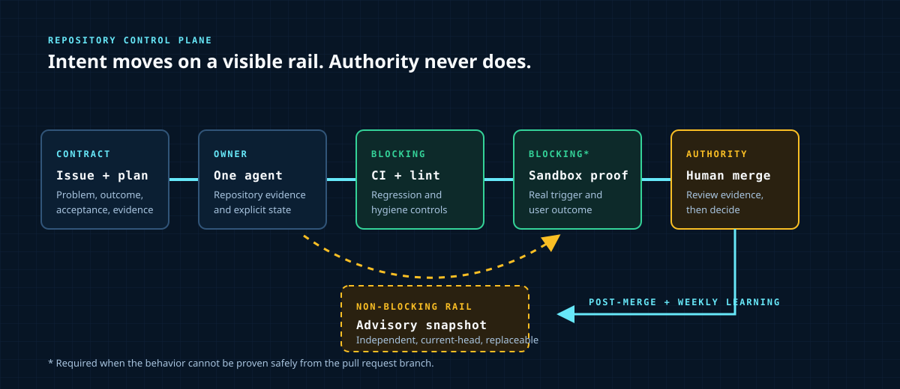
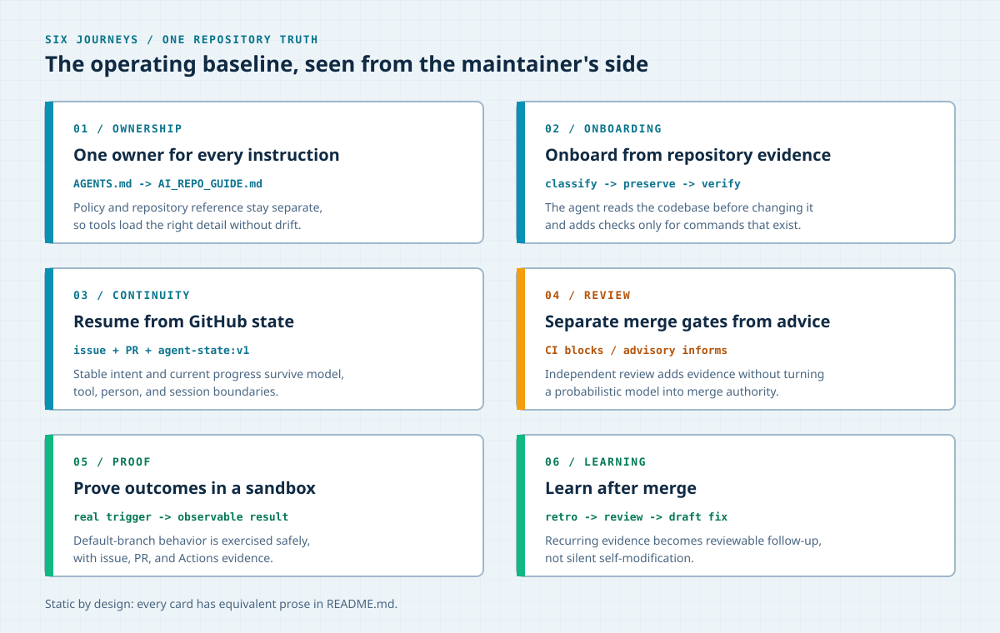

# AI-Ready Repository Template

**A repository operating baseline for teams that want coding agents to work
inside explicit instructions, durable state, blocking checks, and human review.**

This is not an application starter or a replacement for your engineering
process. It is the repository layer that makes an existing process legible to
humans and coding agents across tools and sessions.



The visual shows the core loop: a human defines intent in an issue, one agent
implements against repository evidence, CI blocks regressions, advisory review
adds non-blocking feedback, sandbox verification proves the user outcome, and
post-merge review feeds useful lessons back into the repository.

> **Agent entrypoint:** read [`AGENTS.md`](AGENTS.md) first, then use the compact
> repository catalog in [`AI_REPO_GUIDE.md`](AI_REPO_GUIDE.md).

## The problem this solves

AI coding sessions often begin with enough local context to produce code but
not enough repository context to produce a trustworthy change. Instructions
drift between tools, decisions disappear between sessions, green unit tests are
mistaken for user-outcome proof, and review automation becomes another opaque
agent rather than an auditable control.

This template turns those implicit expectations into repository-owned
contracts:

- one truth hierarchy for instructions, decisions, and live task state;
- one implementing agent by default, without a multi-role coordination tax;
- blocking CI and lint separated from non-blocking advisory feedback;
- GitHub issues, PRs, and one mutable state comment as the durable handoff;
- sandbox verification for behavior that cannot be proven safely on a PR branch;
- recurring post-merge and weekly review that proposes follow-up work without
  bypassing human review.

## Good fit when

- Your team already uses GitHub and one or more coding agents.
- Work crosses sessions, people, models, or IDEs and needs a durable baton.
- You want repository policy to outlive any one agent vendor or chat history.
- CI success is necessary but not sufficient; user outcomes need explicit proof.
- You are willing to review and customize an opinionated operating baseline.

## Not the right fit when

- You need a language, framework, database, or deployment starter.
- The repository is a disposable experiment with no durable review lifecycle.
- You want fully autonomous merge authority with no human-controlled gate.
- You do not use GitHub for issues, pull requests, or Actions.
- A smaller spec template or a single agent instruction file already solves the
  coordination problem.

## Six repository journeys



The board above is a map, not hidden documentation. Each journey is described
below in the order a maintainer encounters it.

### One owner for every instruction

[`AGENTS.md`](AGENTS.md) owns repository-wide operating policy.
[`AI_REPO_GUIDE.md`](AI_REPO_GUIDE.md) catalogs commands and structure without
duplicating that policy. Durable rationale lives under [`docs/`](docs/), while
current project direction lives under [`.context/`](.context/).

### Onboard from repository evidence

The `repo-onboarding` skill classifies this canonical template, a fresh derived
template seed, or an already-onboarded repository. It preserves useful files
and adds stack-specific checks only when the repository supplies evidence for
them.

### Resume from GitHub state

The issue body holds the stable task contract and implementation plan. The PR
holds the implementation and verification contract. One `agent-state:v1`
comment carries the current branch, blockers, outcomes, and next actions, so a
new session does not depend on private chat memory.

### Separate merge gates from advice

CI and lint are blocking controls. The `ai-review:live` advisory workflow runs
in parallel, publishes a replaceable current-head snapshot, and never becomes a
merge gate. Optional multi-model consensus is reserved for consequential
uncertainty instead of routine implementation.

### Prove outcomes in a sandbox

Default-branch-only workflows cannot be fully exercised from an ordinary PR.
The sibling sandbox playbook runs those triggers against disposable branches
and records a real sandbox issue, PR, and Actions run as evidence. Supporting
tests still run locally and in CI, but they do not substitute for the stated
user outcome.

### Learn after merge

Daily post-merge retrospectives and weekly repository review gather evidence,
classify actionable findings, and open reviewable draft fixes. External skill
refreshes are hash-driven, secret-scanned, and fail closed when an upstream
package path moves.

## What each root document does

The split is intentional; these files have different readers and loaders.

| Location | Primary reader | Responsibility |
| --- | --- | --- |
| [`README.md`](README.md) | Human evaluator | Fit, lifecycle, setup, limitations, and public evidence |
| [`AGENTS.md`](AGENTS.md) | Coding agents | Canonical operating contract, quality rules, and execution policy |
| [`AI_REPO_GUIDE.md`](AI_REPO_GUIDE.md) | Coding agents | Compact repository map, commands, workflows, and known warnings |
| [`.context/`](.context/) | Agents and maintainers | Current direction, roadmap, vision, and bounded session context |
| [`docs/`](docs/) | Maintainers | Durable guides, ADRs, research, benchmarks, and postmortems |
| [`.github/prompts/`](.github/prompts/) | Review automation | Shared review lenses and recurring workflow prompts |

[`ADR-022`](docs/decisions/adr-022-top-level-md-scope-split.md) defines this
human/agent split. [`ADR-001`](docs/decisions/adr-001-context-pack-structure.md)
explains why durable documentation and current context are separate.

## Review lifecycle

```text
Issue + plan
    -> draft PR + live state
    -> implementation + tests
    -> CI / lint                 [blocking]
    -> advisory snapshot         [non-blocking]
    -> sandbox user-outcome test [blocking when required]
    -> human review + merge
    -> post-merge / weekly learning
```

The active model is one implementing agent with parallel advisory feedback.
This keeps ownership clear while still using independent review where it adds
value. See [`ADR-031`](docs/decisions/adr-031-agent-model-roi-benchmark-policy.md)
for the benchmark-backed rationale.

## Choose a setup path

### Start a new repository from the template

1. Select **Use this template** on GitHub.
2. Create the target repository.
3. Ask the agent to run the `repo-onboarding` skill.
4. Review the `template-seed` classification before authorizing repository edits.
5. Run `./test.sh`, then add application checks only for verified project commands.

### Add the operating baseline to an existing repository

Copy only the surfaces you intend to maintain, then run `repo-onboarding` to
build a project-specific `AI_REPO_GUIDE.md` and context index. The minimum useful
set is usually `AGENTS.md`, `AI_REPO_GUIDE.md`, `.context/`, the relevant GitHub
templates/workflows, and verification scripts.

### Use the Codespaces bootstrap

GitHub Codespaces has a feature named **Dotfiles** that runs an install script
at startup. Select this repository under
[Codespaces settings](https://github.com/settings/codespaces), enable
**Automatically install dotfiles**, and the next Codespace will run
[`install.sh`](install.sh). This repository uses the hook as a bootstrap; it is
not a traditional shell-dotfiles collection.

## Verify the baseline

```bash
./test.sh
```

A successful run ends with `Failed: 0` and `Template verification PASSED`.
Before merging a task, also run the focused tests named in its plan, classify
workflow verifiability with [`scripts/verify-pr.sh`](scripts/verify-pr.sh), and
follow the [sandbox playbook](docs/guides/sandbox-verification.md) when the
behavior depends on a default-branch trigger.

## Compare adjacent approaches

**Evaluated: 2026-07-22.** This table compares the projects' current official
README claims, not every capability in their codebases or documentation. It is
intended to help select a starting point, not rank the projects. `Not stated`
means the official README does not make that claim; `Not evaluated` means this
review did not test it.

| Dimension | ai-repo-template | [GitHub Spec Kit](https://github.com/github/spec-kit) | [BMAD Method](https://github.com/bmad-code-org/BMAD-METHOD) | [Spec Kitty](https://github.com/Priivacy-ai/spec-kitty) |
| --- | --- | --- | --- | --- |
| Primary focus | Repository operating policy, continuity, review, and verification | Spec-driven development from constitution through implementation | Scale-adaptive agile method with specialized agent collaborators | Repo-native missions, work packages, governance, and agent execution |
| Adoption path | GitHub template, selective copy, or Codespaces bootstrap | `specify` CLI through `uv`, `pipx`, or PyPI | Interactive or non-interactive `npx bmad-method install` | `pipx`, `uv tool`, or virtual-environment install |
| Durable project state | GitHub issue/PR state plus `.context/`, docs, and ADRs | Specifications, plans, tasks, templates, extensions, and presets | Structured workflows and module configuration; artifact location not evaluated | `kitty-specs/` mission artifacts, work-package lanes, and review state |
| Agent model stated in README | One implementing agent; optional independent advisory or consensus | 30+ agent integrations; concurrent execution model not stated | 12+ specialized agents and Party Mode | Multiple agents in isolated Git worktrees |
| Review and merge model | Blocking CI/lint, non-blocking advisory, sandbox outcome proof, human merge | Optional analysis/checklist commands; merge policy not stated | Test Architect module exists; merge policy not stated | Explicit `review -> accept -> merge` loop |
| Recurring learning | Daily post-merge retro, weekly review, and postmortem feedback | Not stated | Not stated | Per-mission retrospective by default |
| Application stack included | No | No fixed application stack stated | No fixed application stack stated | No fixed application stack stated |

Sources: [Spec Kit README](https://github.com/github/spec-kit/blob/main/README.md),
[BMAD Method README](https://github.com/bmad-code-org/BMAD-METHOD/blob/main/README.md),
and [Spec Kitty README](https://github.com/Priivacy-ai/spec-kitty/blob/main/README.md).
Re-evaluate before using this table for a later decision because these projects
change independently.

## Customize deliberately

- Put repository-wide rules in [`AGENTS.md`](AGENTS.md), not in duplicated tool
  prompts.
- Update [`AI_REPO_GUIDE.md`](AI_REPO_GUIDE.md) when commands, paths, workflows,
  or warnings change.
- Add application checks only after onboarding verifies the project command.
- Record architectural choices under [`docs/decisions/`](docs/decisions/).
- Keep active direction in [`.context/`](.context/) and live coordination in
  GitHub.
- Review vendored skill bytes and immutable refs through
  [`skills-lock.json`](skills-lock.json) and the
  [skill supply-chain guide](docs/guides/skill-supply-chain.md).

## Limits and explicit non-goals

- **No application runtime.** Bring your own language, framework, data, build,
  test, and deployment stack.
- **Opinionated GitHub workflow.** The strongest continuity and sandbox controls
  assume GitHub Issues, Pull Requests, Actions, and Codespaces.
- **Human review remains required.** Advisory agents and recurring workflows
  propose evidence and fixes; they do not receive merge authority.
- **Maintenance is part of adoption.** Remove workflows and skills your project
  will not own instead of retaining inactive complexity.
- **Video is intentionally deferred.** Add capture tooling only if a documented
  comprehension test finds a temporal misunderstanding that the static hero,
  six-journey board, and equivalent prose cannot resolve.

## Further reference

- [Repository map and commands](AI_REPO_GUIDE.md)
- [Why the context files are separate](docs/guides/context-files-explained.md)
- [Agent pipeline and workflow classes](docs/guides/agent-pipeline.md)
- [Sandbox verification](docs/guides/sandbox-verification.md)
- [Frequently asked questions](docs/FAQ.md)
- [Architecture decisions](docs/decisions/README.md)

## License

MIT. Fork and adapt the baseline to the process your team can actually
maintain.
